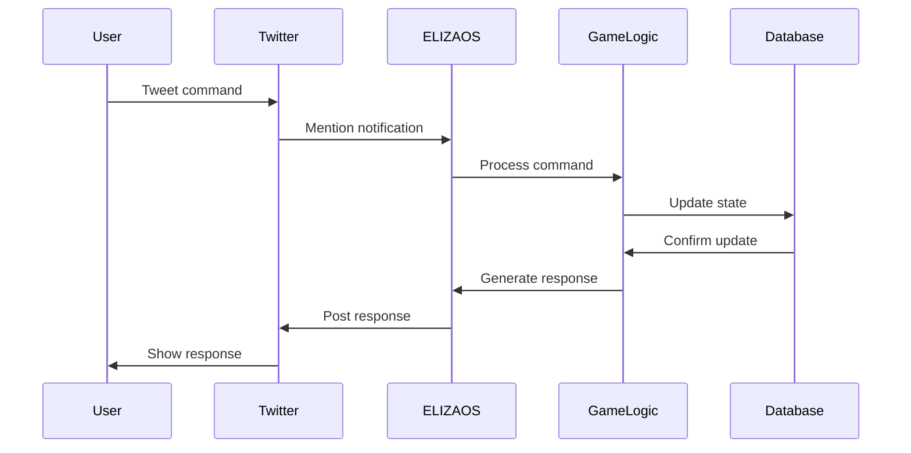
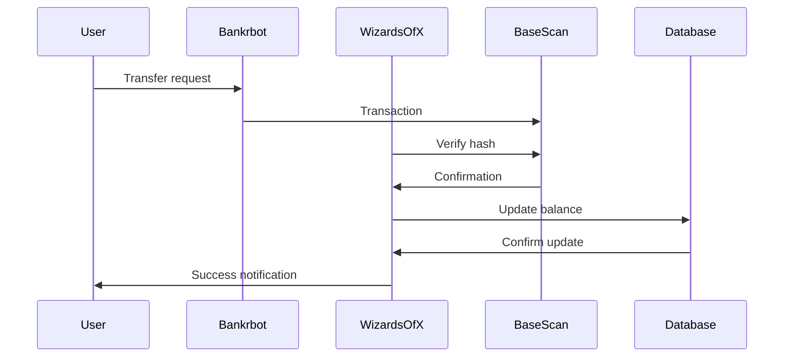

# Wizards of X: System Architecture

## Overview
Wizards of X is a Twitter-native game built on ELIZAOS framework, running on Google Cloud VM. The system processes all game actions through tweets, with banking handled by @bankrbot integration.

## System Components

### 1. Infrastructure Layer
- **Google Cloud VM (e2-micro)**
  - 1 vCPU, 1GB RAM
  - Ubuntu 20.04 LTS
  - Python 3.8+
  - MySQL 8.0

### 2. ELIZAOS Framework Integration
```
wizards-of-x/
├── agents/
│   ├── wizard_agent.json   # Agent configuration
│   └── responses/          # Response templates
├── game_logic/            # Core game mechanics
├── database/             # Database operations
├── utils/               # Helper functions
└── monitoring/         # System monitoring
```

#### Key Components:
- **Tweet Monitoring System**
  - Watches @WizardsOfX mentions
  - Processes commands from tweet text
  - Handles rate limiting
  - Maintains conversation context

- **Memory System**
  - Short-term: Active duels, tournaments
  - Long-term: Player data, transaction history
  - Hybrid storage for game state

### 3. Database Architecture

#### Core Tables
```sql
players
├── twitter_handle (PK)
├── name
├── house
├── level
├── xp
├── hp
├── bonus_galleons
├── withdrawable_galleons
├── spells (JSON)
└── potions (JSON)

active_duels
├── id (PK)
├── player1
├── player2
├── bet_amount
├── status
├── turn
├── hp1
└── hp2

withdrawal_requests
├── id (PK)
├── twitter_handle
├── amount
├── fee
├── tx_hash
└── status

burn_queue
├── id (PK)
├── amount
├── scheduled_time
└── status
```

### 4. Game Logic Layer

#### Character System
- House assignment
- Stats calculation
- XP/Level progression
- Inventory management

#### Combat System
- Turn-based dueling
- Spell combinations
- Damage calculation
- State management

#### Banking System
- @bankrbot integration
- Transaction verification
- Prize pool management
- Burn queue processing

### 5. Monitoring & Recovery

#### System Monitoring
- VM resource tracking
- Database performance
- API response times
- Tweet processing metrics

#### Error Recovery
- Transaction rollback
- State recovery
- Duel interruption handling
- Tournament state management

### 6. Security Architecture

#### Transaction Security
- Hash verification via Base scan
- Balance validation
- State consistency checks

#### Game Security
- Rate limiting
- State validation
- Anti-cheat measures

#### Infrastructure Security
- VM firewall rules
- Database access control
- Backup encryption

## Data Flow

### 1. Command Processing


### 2. Banking Flow


## Performance Characteristics

### Response Times
- Command processing: < 500ms
- Database operations: < 100ms
- Tweet monitoring: < 1s delay

### Concurrency
- Concurrent duels: 45+
- Tournament capacity: 128+ players
- Database connections: 20+

### Resource Usage
- CPU: < 80% sustained
- Memory: < 800MB
- Database size: < 10GB

## Scaling Considerations

### Current Limits
- 100 concurrent users
- 50 simultaneous duels
- 128 players per tournament

### Bottlenecks
1. VM resources (1GB RAM)
2. Database connections
3. Twitter rate limits

### Expansion Options
1. VM upgrade path
2. Database sharding
3. Read replicas for scaling

## Disaster Recovery

### Backup System
- Daily database backups
- State snapshots
- Configuration backups

### Recovery Procedures
1. Transaction rollback
2. State restoration
3. Database recovery
4. System restoration

## Integration Points

### External Services
1. Twitter API (via ELIZAOS)
2. @bankrbot
3. Base scan
4. Discord webhooks

### Internal Services
1. Game logic
2. Database
3. Monitoring
4. Recovery systems

## Development Workflow

### Environment Setup
1. Local development
2. Testing environment
3. Production environment

### Deployment Process
1. Code review
2. Testing suite
3. Staging deployment
4. Production release

## Maintenance Procedures

### Regular Tasks
- Database cleanup
- Log rotation
- Backup verification
- Performance monitoring

### Emergency Procedures
- System recovery
- State restoration
- Transaction reconciliation
- Error investigation

Remember: This is a Twitter-native game. All interactions happen through tweets, with ELIZAOS handling the communication layer and @bankrbot managing the banking operations. 